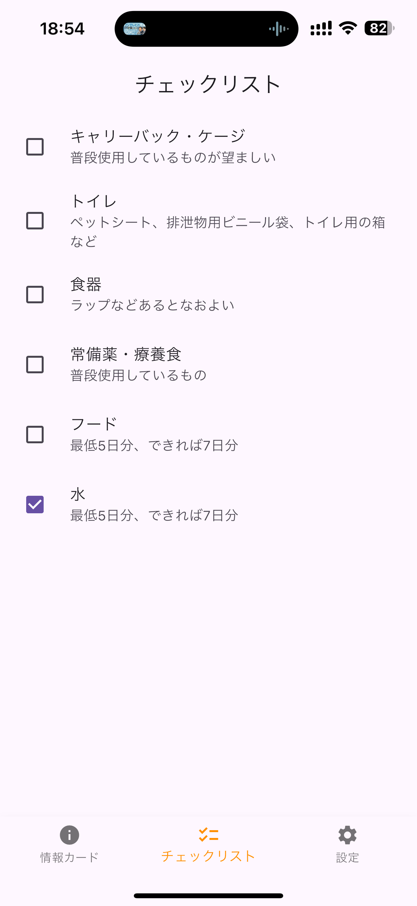
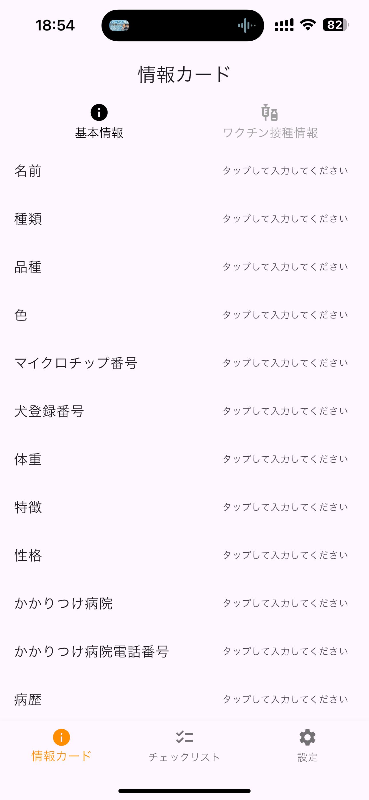

# Nose Touch | Pet Owner Disaster Preparedness App

This open-source disaster preparedness application is designed specifically for pet owners. It enables you to record essential information about your pets and securely store this data locally on your device. In the event of an emergency, you can quickly access historical health records — such as vaccination details, pet profiles, and more — ensuring you have the necessary information at your fingertips.

## Download the App
You can download the latest version of the application directly from the App Store:
[Download on the App Store](https://apps.apple.com/us/app/%E3%83%8E%E3%83%BC%E3%82%BA%E3%82%BF%E3%83%83%E3%83%81/id6636473374)

## Key Features
- Enter and update basic pet information.
- Record and monitor vaccination details.
- Scan and store vaccination certificates electronically.
- Access vital disaster preparedness information.

### Screenshots

| Pet | Preparedness |
| --- | --- |
|  |  |

## Development & Setup
For developers interested in contributing, please follow these steps to set up your local development environment:

```bash
git clone https://github.com/tied-inc/nose_touch_app.git
cd nose_touch_app
flutter pub get
flutter run
```

### Data Models
For a detailed overview of the data models used in this project, please refer to the [data_models.md](docs/data_models.md) file.

### Reporting Issues
If you encounter any problems or have suggestions, please open an issue in our GitHub repository. We encourage you to review our issue template to provide detailed information:
[Issue Reporting Guidelines](https://github.com/your-username/your-repo/issues/new/choose)

### Open Source & Community Inspiration
Built with the open source spirit in mind, this project draws inspiration from successful OSS initiatives such as Home Assistant and Nextcloud. By adopting best practices from the broader open source community, we aim to deliver a reliable, privacy-conscious tool for pet owners worldwide.

We welcome contributions from developers, pet enthusiasts, and disaster preparedness advocates. Please review our contribution guidelines (see CONTRIBUTING.md) and join the discussion on our GitHub repository.

## License
This project is licensed under the MIT License.


