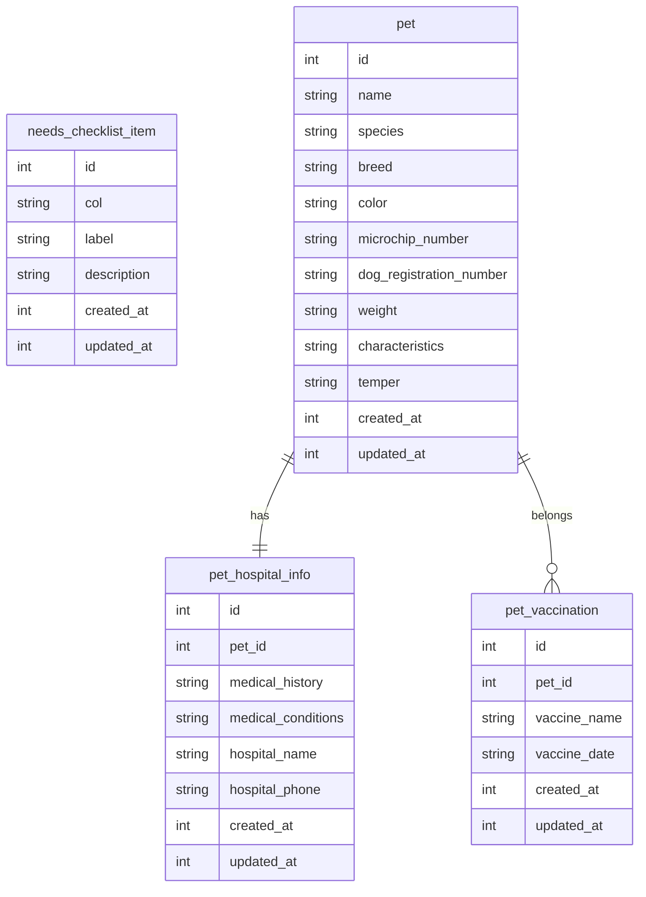

# Data models 

```mermaid
erDiagram
    needs_checklist_item {
        int id 
        string col 
        string label
        string description 
        int created_at 
        int updated_at 
    }
    
    pet {
        int id 
        string name 
        string species 
        string breed 
        string color
        string microchip_number 
        string dog_registration_number 
        string weight 
        string characteristics 
        string temper
        int created_at 
        int updated_at 
    }
    
    pet_hospital_info { 
        int id 
        int pet_id 
        string medical_history 
        string medical_conditions
        string hospital_name 
        string hospital_phone 
        int created_at 
        int updated_at 
    }
    
    pet_vaccination {
        int id 
        int pet_id 
        string vaccine_name 
        string vaccine_date 
        int created_at 
        int updated_at 
    }
    
    pet ||--|| pet_hospital_info : has
    pet ||--o{ pet_vaccination : belongs

```